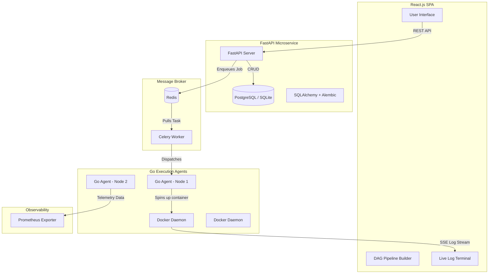

# Grid Ops - Enterprise MLOps SaaS Platform

Grid Ops is an industry-grade Distributed ML orchestration platform designed to scavenge idle computing cycles across an institution (e.g. university labs) and provide a seamless, cloud-like experience for researchers.

It allows users to submit PyTorch/TensorFlow jobs, visually build execution DAGs, auto-scale cloud instances, and instantly deploy models to inference servers.

## 🏗 System Architecture



## ✨ Key Features

1. **Multi-Tenant Organizations (RBAC)**: Supports multiple organizations, workspaces, and strict data isolation.
2. **Containerized Execution**: Go agents interact with the Docker SDK to dynamically pull `pytorch` images, mount datasets, and run jobs in isolated containers.
3. **One-Click Model Serving**: Trained models can be instantly deployed into long-running FastApi inference containers.
4. **Live Hardware Telemetry**: The Go Agent exports CPU, RAM, and GPU temperature metrics via Prometheus, streamed directly to the React dashboard.
5. **Auto-Scaling Infrastructure**: A background asyncio loop in FastAPI monitors Celery queue lengths and uses `boto3` to provision AWS EC2 Spot Instances during high load.
6. **Interactive JupyterLab**: Provision isolated Jupyter Notebook sessions backed by edge node compute.

## 🚀 Getting Started

### 1. Start the React Frontend
```bash
cd saas-portal/frontend
npm install
npm run dev
```

### 2. Start the FastAPI Backend
```bash
cd saas-portal/backend
pip install -r requirements.txt
uvicorn app.main:app --reload
```

### 3. Start the Celery Worker
*Requires Redis running on `localhost:6379`*
```bash
cd saas-portal/backend
celery -A app.celery_worker worker --loglevel=info
```

### 4. Run the Go Edge Agent
```bash
cd execute-node-agent
go build -o agent.exe ./cmd/agent/main.go
./agent.exe --token=secret_token
```

## 🛠 Tech Stack
- **Frontend**: React, Vite, Recharts, React Flow (DAG)
- **Backend**: Python, FastAPI, SQLAlchemy, Alembic, Celery
- **Datastore**: SQLite (Dev) / PostgreSQL (Prod), Redis
- **Edge Agent**: Golang, Docker SDK, Prometheus SDK
- **DevOps**: GitHub Actions (CI/CD), Terraform (AWS IaC)
