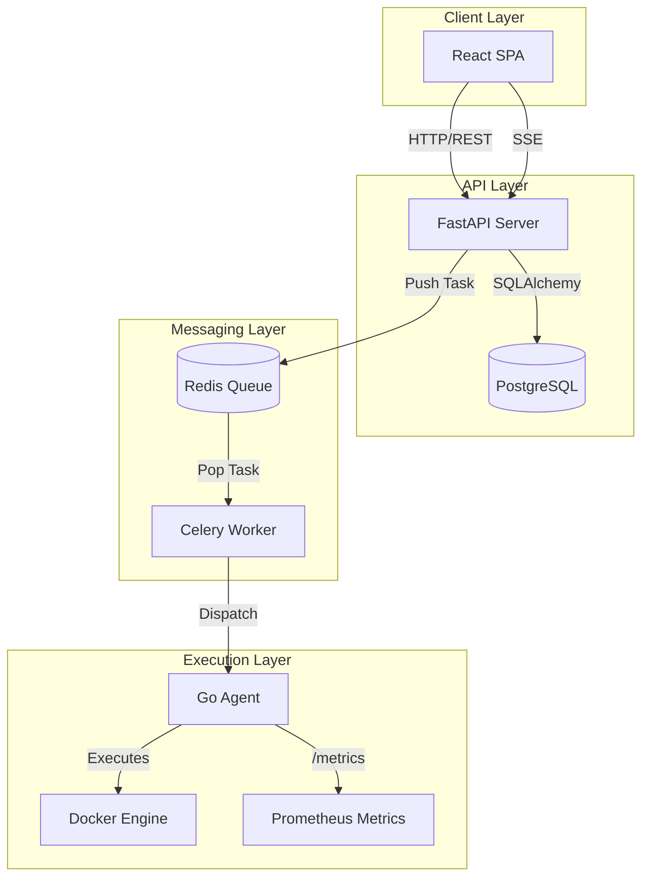
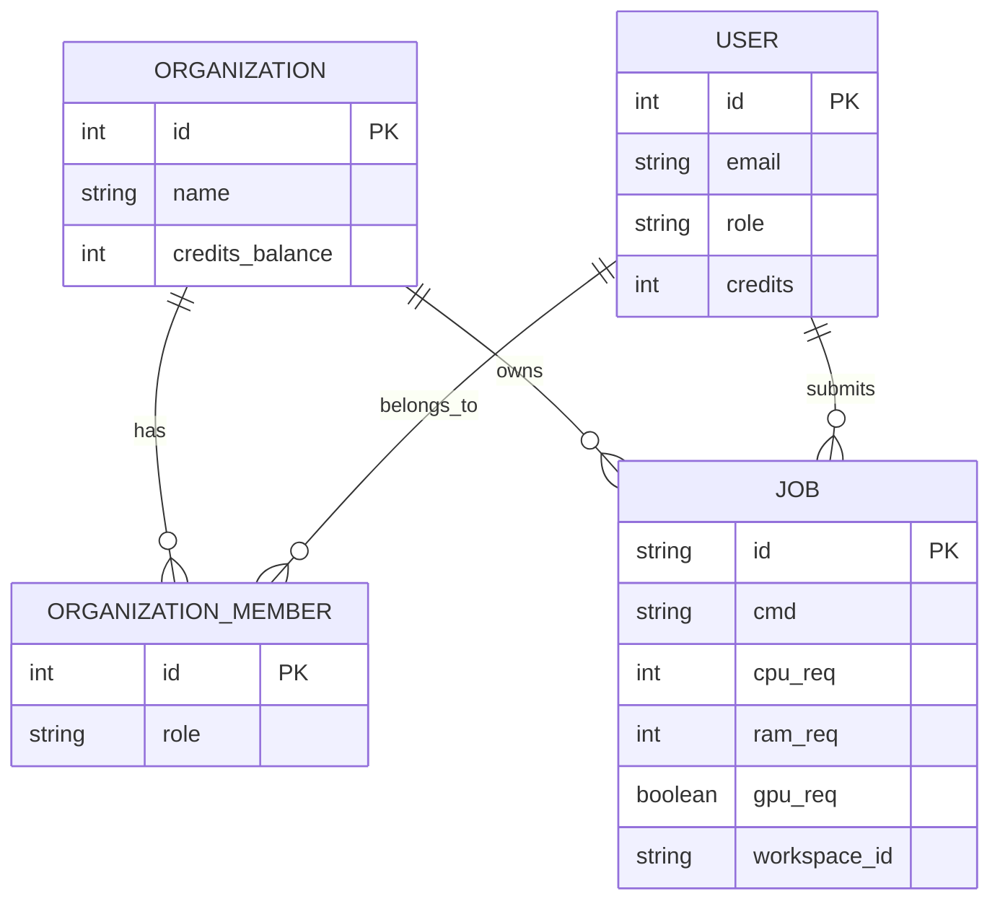

# System Architecture

The Grid Ops platform is a distributed compute orchestration system. It is split into four primary layers: the web frontend, the API gateway/backend, the asynchronous task queue, and the edge execution nodes.

## High-Level Topology

## Component Breakdown

### 1. Client Layer (React.js)
Built with React and Vite. It serves as the primary interface for job submission, pipeline DAG construction, and metric monitoring.
- **State Management**: React Hooks (useState, useEffect).
- **Visualization**: Recharts for telemetry data, React Flow for DAG pipeline building.
- **Real-time Logging**: Consumes Server-Sent Events (SSE) from the backend for live job stdout/stderr.

### 2. API Layer (FastAPI & PostgreSQL)
Handles authentication, organization management, and job routing.
- **Framework**: FastAPI (Python 3.10+).
- **Database**: PostgreSQL (SQLite used in dev). Managed via SQLAlchemy ORM.
- **Migrations**: Alembic tracks schema changes (e.g. the addition of the `Organization` multi-tenant tables).
- **Auto-Scaler**: An `asyncio` background task monitors the Redis queue length. If a threshold is crossed, it mocks `boto3` calls to provision AWS EC2 Spot instances.

### 3. Messaging Layer (Redis & Celery)
Decouples API response times from job execution times.
- **Broker**: Redis runs on port 6379.
- **Worker**: Celery workers pull from the queue and interface with the network of Go agents.

### 4. Execution Layer (Go Agent & Docker)
The edge nodes that actually process the compute workloads.
- **Agent**: Written in Go. Handles node registration, telemetry, and process supervision.
- **Isolation**: Uses the official Docker Go SDK (`github.com/docker/docker/client`). When a job is received, the agent creates a container (e.g. `pytorch/pytorch`), maps the host filesystem as a bind mount, executes the script, streams logs back, and then destroys the container to prevent data leakage between jobs.
- **Inference & Jupyter**: The agent can also spin up long-running containers mapping ports for interactive JupyterLab sessions and FastAPI model inference endpoints.

## Database Schema (ERD)

